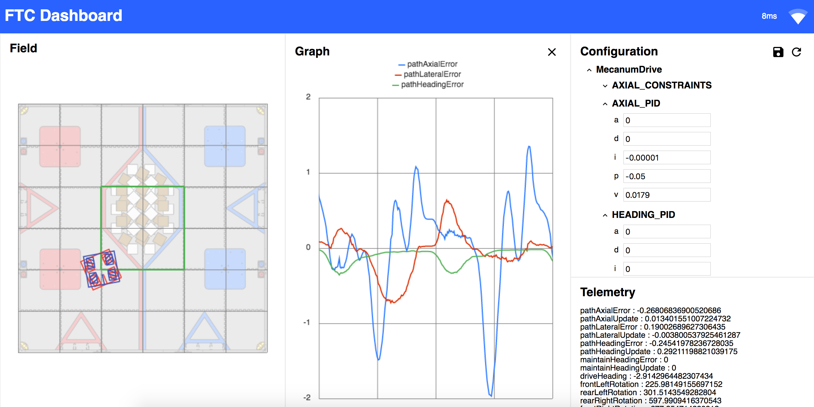

# FTC Dashboard

FTC Dashboard provides telemetry and monitoring tools for the FTC robots during operation with the following features:

- Live telemetry with plots and field graphics
- Live configuration variables
- Camera streaming
- Limited op mode controls and gamepad support
  - Note: Gamepad support is volatile due to unstable browser API's
- Custom dashboard layouts
- Telemetry CSV export

Check out our [online documentation](https://acmerobotics.github.io/ftc-dashboard).

|       Screenshot of custom layout        |          Screenshot with theme           |
| :--------------------------------------: | :--------------------------------------: |
|  |  |



# Installation

Most up to date installation can be found online here: [https://acmerobotics.github.io/ftc-dashboard/gettingstarted](https://acmerobotics.github.io/ftc-dashboard/gettingstarted)

## Basic

1. Open [`build.dependencies.gradle`](https://github.com/FIRST-Tech-Challenge/FtcRobotController/blob/master/build.dependencies.gradle)
2. In the `repositories` section, add `maven { url = 'https://maven.brott.dev/' }`
3. In the `dependencies` section, add `implementation 'com.acmerobotics.dashboard:dashboard:0.4.8'`
   - Please see [GitHub releases page](https://github.com/acmerobotics/ftc-dashboard/releases) for latest version number
4. Note: If you’re using OpenRC or have non-standard SDK dependencies, add the following exclusion:

```
implementation('com.acmerobotics.dashboard:dashboard:0.4.8') {
    exclude group: 'org.firstinspires.ftc'
}
```

See the online documentation [getting started page](https://acmerobotics.github.io/ftc-dashboard/gettingstarted) for the following installation instructions:

- Running a local version of FTC Dashboard
  - For custom development purposes or testing out the latest dashboard java-side features prior to release
  - See "Advanced" section on the getting started page for more details
- Usage with the FTC SDK
- Development
  - For custom development of FTC Dashboard browser client

# Browser Client Development

## Installation

See the online documentation [getting started page](https://acmerobotics.github.io/ftc-dashboard/gettingstarted) for further details

1. Install Node.js

   - Note: Node.js 16+ is required for builds to work on the M1 macbooks
   - Current Node version used in gradle builds can be found in [FtcDashboard/build.gradle](https://github.com/acmerobotics/ftc-dashboard/blob/8ac8b29257dede5f4a13c440fe6756efc270cbb8/FtcDashboard/build.gradle#L4)
   - Node version is `18.12.1` as of time of writing

2. Install Yarn

   - Not explicitly required and provides little advantage over modern `npm` (as of the time of writing)
   - Further instructions will however reference `yarn` over `npm` for historical reasons

3. Browser FTC Dashboard client is located in `FtcDashboard/dash`

4. Run `yarn` (alternatively `npm install`) to install dependencies

   - This only need be done once

5. Optionally, specify the server IP address through the environment variable: `VITE_REACT_APP_HOST`

   - It is the author recommendation to save `VITE_REACT_APP_HOST=<insert IP>` in a `.env.development.local` file

     - Details on Vite's environment variables can be found [here](https://vitejs.dev/guide/env-and-mode.html)

   - Alternatively, prefix the following command (in the next step) with `VITE_REACT_APP_HOST=<insert IP>`

   - Default IP's:
     - Android Phone: `192.168.49.1`
     - Control Hub: `192.168.43.1`

6. Run `yarn dev` (alternatively `npm run dev`) to start the development server

   - This will start a development server on [`http://localhost:3000`](http://localhost:3000) by default
   - Navigate to this address in your browser to view the dashboard client
   - The development server will automatically reload when changes are made to the source code

## Basic Architecture

### Java Server

Dashboard's server is split into two packages, `DashboardCore` and `FtcDashboard`

- [Dashboard Core](https://github.com/acmerobotics/ftc-dashboard/tree/master/DashboardCore/src/main/java/com/acmerobotics/dashboard)
  - A standalone library that can be used to create a dashboard server for any Java application
- [FtcDashboard](https://github.com/acmerobotics/ftc-dashboard/tree/master/FtcDashboard/src/main/java/com/acmerobotics/dashboard)
  - A wrapper around `DashboardCore` that provides relevant tooling and hooks for FTC teams
  - Contains the API FTC teams will access and manipulate through their own code
  - This package also contains the browser client source

### Browser Client

Primary interface as a web-client acessible to the end-user through a web browser

- Located in [`FtcDashboard/dash`](https://github.com/acmerobotics/ftc-dashboard/tree/master/FtcDashboard/dash)
- Installation and run instructions mentioned above
- TypeScript + React application
- Vite for builds
- Web Socket connection to the dashboard server

#### Relevant files

- [Dashboard.tsx](https://github.com/acmerobotics/ftc-dashboard/blob/master/FtcDashboard/dash/src/components/Dashboard/Dashboard.tsx)
  - Primary functional entrypoint
- [LayoutPreset.tsx](https://github.com/acmerobotics/ftc-dashboard/blob/master/FtcDashboard/dash/src/enums/LayoutPreset.tsx)
  - Contains preset layouts
- [`views/`](https://github.com/acmerobotics/ftc-dashboard/tree/master/FtcDashboard/dash/src/components/views)
  - Contains the various views that can be displayed on the dashboard
    - Graphs
    - Telemetry
    - Gamepad
    - etc
- [`store/`](https://github.com/acmerobotics/ftc-dashboard/tree/master/FtcDashboard/dash/src/store)
  - Contains shared state management logic
    - Web Socket connection
    - Gamepad state management
    - Storage middleware
    - etc
- Views subscribe to websocket updates via the Redux store
  - Basic example can be found in the [`TelemetryView`](https://github.com/acmerobotics/ftc-dashboard/blob/8ac8b29257dede5f4a13c440fe6756efc270cbb8/FtcDashboard/dash/src/components/views/TelemetryView.tsx#L21) component

## Mock server

For testing dashboard client without a robot

- Java mock FTC Dashboard server is located in [`DashboardCore/src/test/java/com/acmerobotics/roadrunner/`](https://github.com/acmerobotics/ftc-dashboard/blob/master/DashboardCore/src/test/java/com/acmerobotics/roadrunner/TestServer.java)
- Mock server is a simple Java server hosting mock FTC opmode
- Run this Java file with your choice of JVM application runner (e.g. through Intellij)
- A test sample opmode can be found at [`TestSineWaveOpMode.java`](https://github.com/acmerobotics/ftc-dashboard/blob/master/DashboardCore/src/test/java/com/acmerobotics/roadrunner/TestSineWaveOpMode.java)
- Test opmodes registered in [`TestOpmodeManager.java`](https://github.com/acmerobotics/ftc-dashboard/blob/8ac8b29257dede5f4a13c440fe6756efc270cbb8/DashboardCore/src/test/java/com/acmerobotics/roadrunner/testopmode/TestOpModeManager.java#L10)
