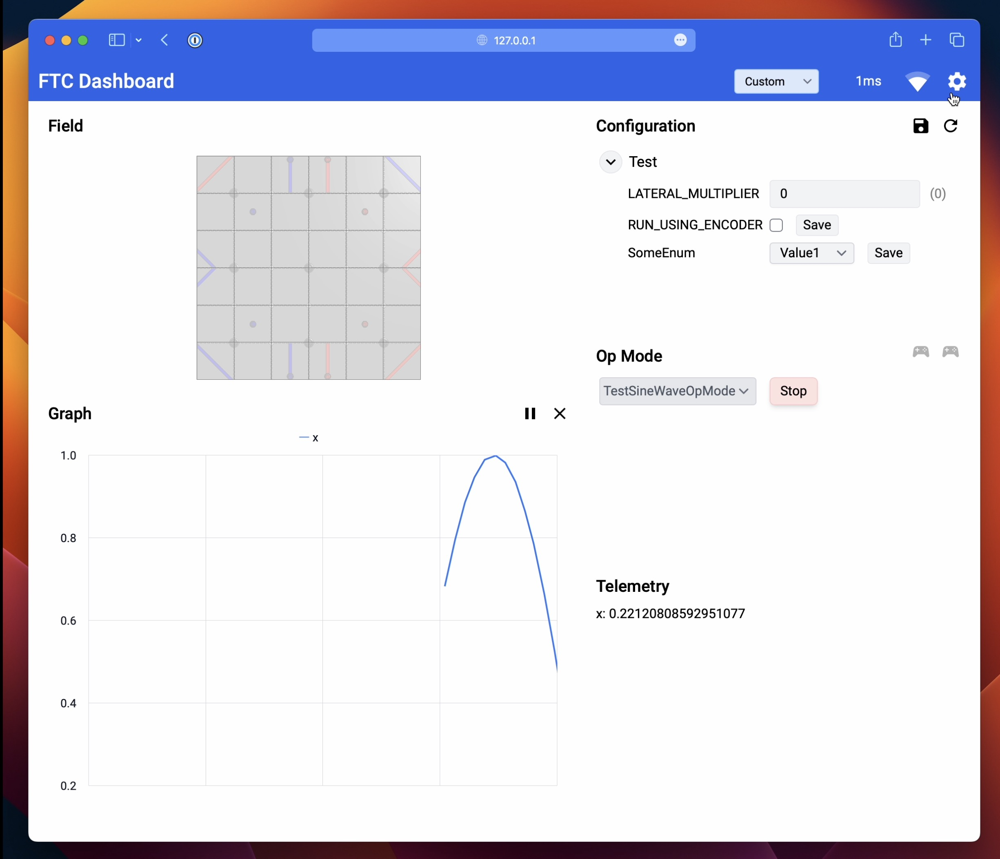
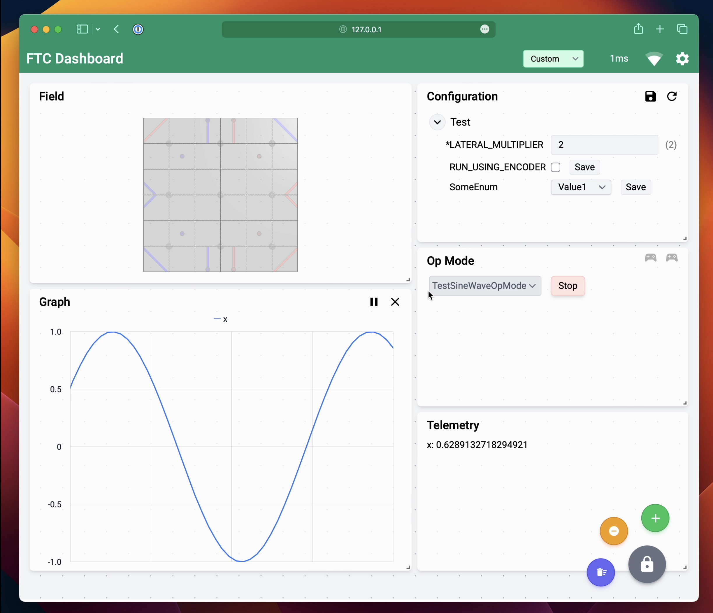

# Overview

[FTC Dashboard]({{ site.github.repository_url }}) is a web app for monitoring FTC robots during operation with the following features:

* Telemetry with plots and field graphics
* Live configuration variables
* Camera streaming
* Limited op mode controls and gamepad support

|     Screenshot of custom layout     |        Screenshot with theme        |
| :---------------------------------: | :---------------------------------: |
|  |  |

# Documentation

[Getting Started](gettingstarted)

[Features](features)

* [Telemetry](features#telemetry)

* [Field View](fieldview)

* [Configuration Variables](features#configuration-variables)

* [Op Mode Controls](features#op-mode-controls)

* [Camera](features#camera)

[Competition Use](competition)

[Samples](https://github.com/acmerobotics/ftc-dashboard/tree/master/TeamCode/src/main/java/org/firstinspires/ftc/teamcode)

[Javadoc](javadoc)
